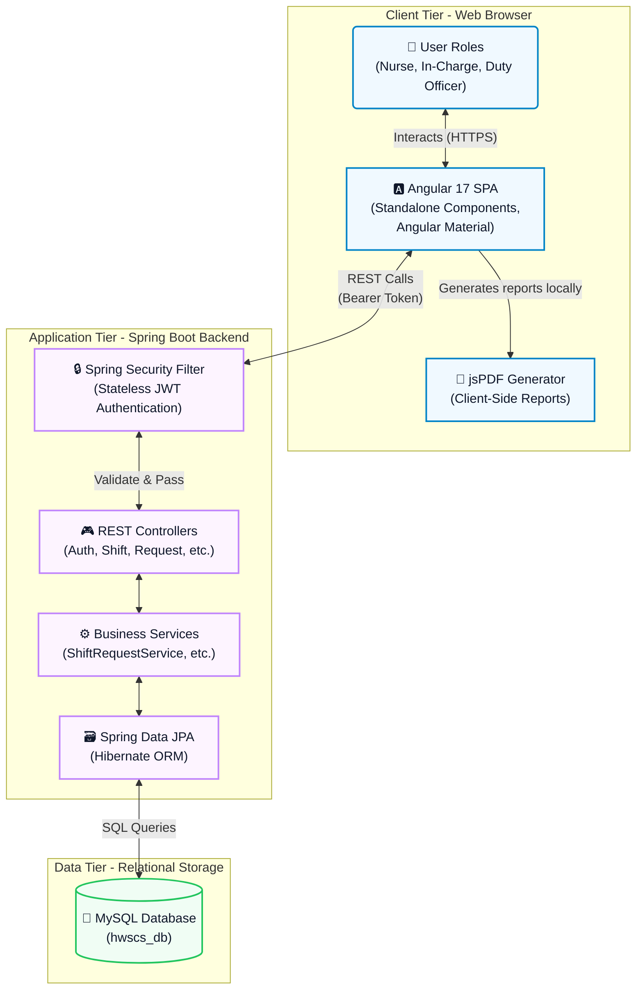
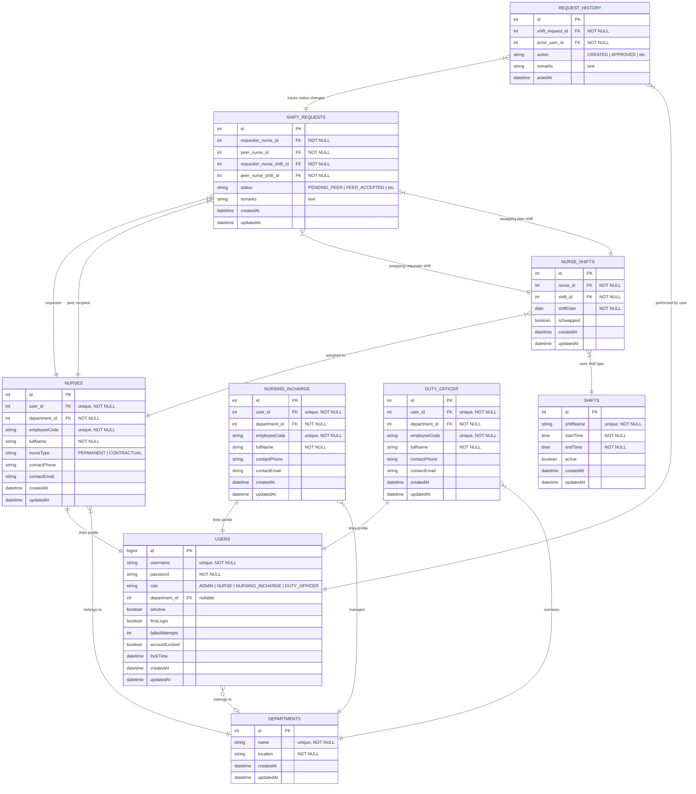
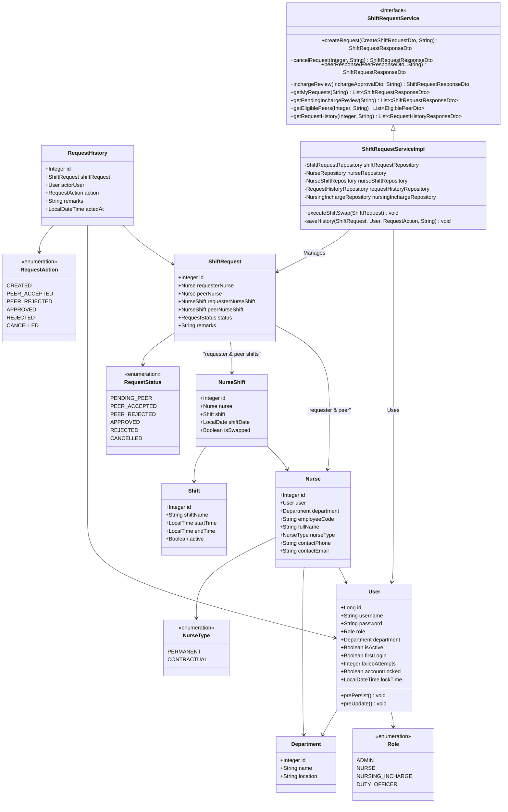
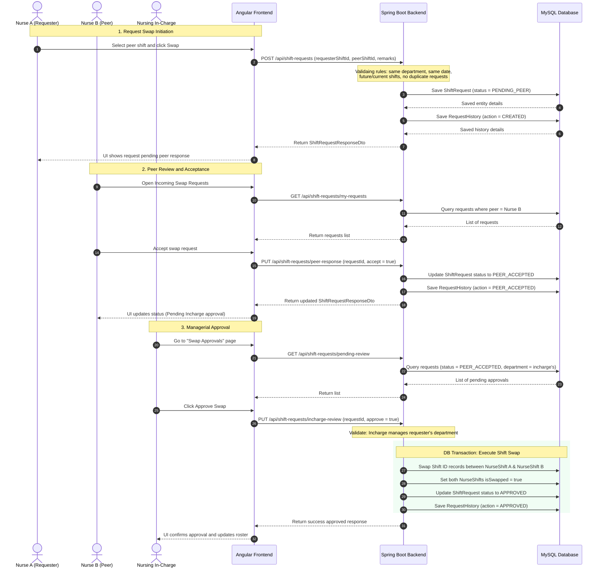
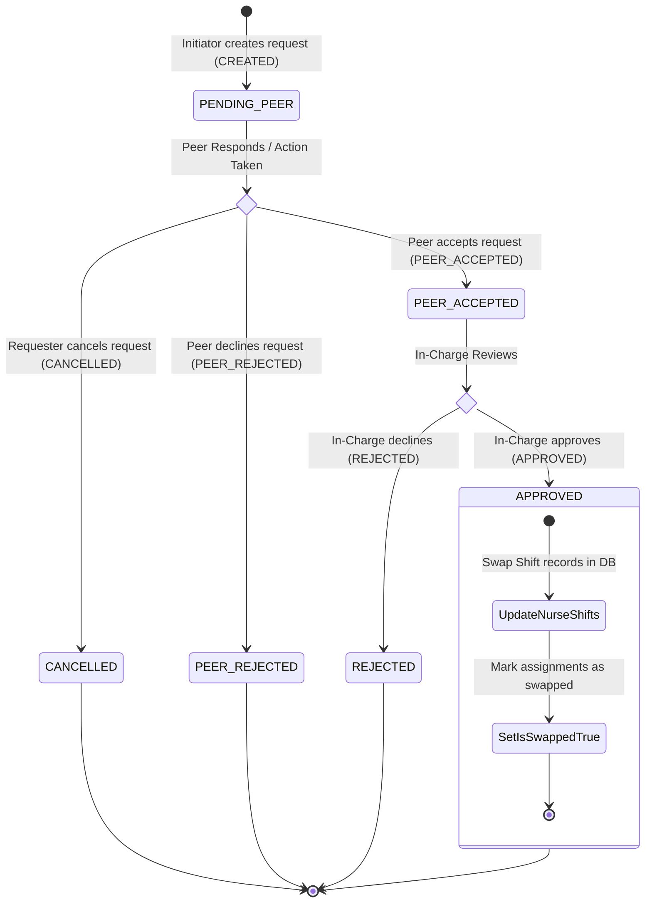
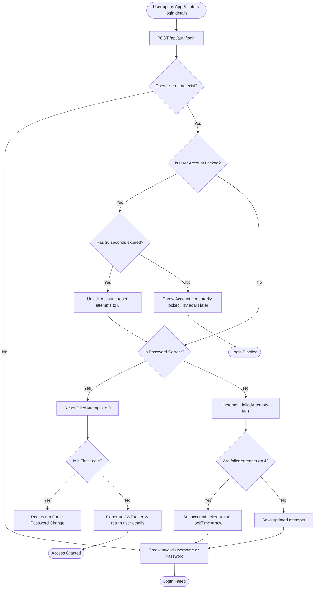
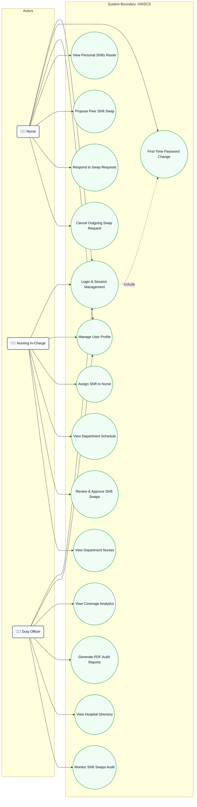

# Hospital Workforce Shift Coordination System (HWSCS) - Diagrams

This document contains a comprehensive collection of architecture and design diagrams for the **Hospital Workforce Shift Coordination System (HWSCS)**. The diagrams are represented using **Mermaid.js** syntax, which renders natively in Markdown viewers.

---

## 1. System Architecture (C4 Container Diagram)

The system is built on a modern multi-tier architecture, featuring an **Angular SPA frontend**, a **Spring Boot REST API backend**, and a **MySQL Database**. PDF report generation is offloaded to the client using `jsPDF` to optimize server resource usage.

---

## 2. Entity-Relationship (ER) Diagram

The HWSCS relational database model tracks users, their roles, hospital department structures, schedules, and the full audit trail of shift swaps.

---

## 3. UML Class Diagram (Core Domain & Services)

Below is the Class Diagram representing the relationships, attributes, and key operations of the domain entities, service layer implementations, and status enums.

---

## 4. Sequence Diagram: Shift Swap Request Lifecycle

This sequence diagram details the full, transactional, multi-step workflow involved in proposing and finalizing a shift swap between two nurses within a department.

---

## 5. State Machine Diagram: ShiftRequest Status Lifecycle

The state machine diagram defines all valid state transitions for a shift swap request, starting from creation to ultimate completion or rejection.

---

## 6. Activity Diagram: User Login & Account Lockout Flow

This flowchart illustrates the authentication process, password validation, enforcing first-time password resets, and account lockout handling (lockout triggers after 4 failed attempts; locks for 30 seconds).

---

## 7. Use Case Diagram

The Use Case Diagram displays system capabilities partitioned by user role boundaries, including Nurses, Nursing In-Charge, and Duty Officers.

